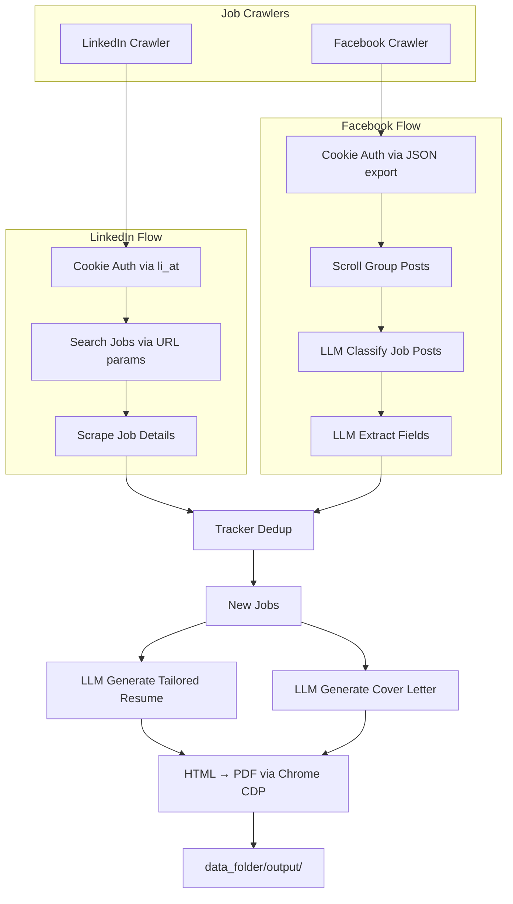

# AIHawk: AI-Powered Job Application Agent

AIHawk is an AI-powered job application tool that crawls job listings from LinkedIn and Facebook groups, then uses LLMs to generate tailored resumes and cover letters as PDFs.

## How It Works



## Installation

```bash
uv venv
uv pip install -r requirements.txt
```

## Usage

### Interactive Mode

Generate a resume or cover letter for a specific job URL:

```bash
uv run python main.py
```

### Automated Crawler Mode

Crawl LinkedIn and/or Facebook for jobs, auto-generate documents:

```bash
uv run python -m src.crawlers.runner
```

Schedule with cron for recurring runs.

## Configuration

### LLM Provider

Set in `config.py`:
- `LLM_MODEL_TYPE` — `openai`, `claude`, `ollama`, `gemini`, `huggingface`, or `perplexity`
- `LLM_MODEL` — model name (e.g., `gpt-4o-mini`, `GLM-4.7`)
- `LLM_API_URL` — custom endpoint for OpenAI-compatible APIs

### User Data

All user data lives in `data_folder/` (see `data_folder_example/` for templates):

| File | Purpose |
|------|---------|
| `secrets.yaml` | LLM API key + LinkedIn cookies (`li_at`, `li_rm`) |
| `plain_text_resume.yaml` | Your resume content in YAML format |
| `work_preferences.yaml` | Job preferences (experience levels, job types, blacklists) |
| `crawler_config.yaml` | Crawler settings (enabled crawlers, filters, rate limiting) |
| `facebook.com.cookies.json` | Facebook cookies (exported from browser extension) |

### Crawler Config

```yaml
enabled_crawlers:
  - linkedin
  - facebook

linkedin:
  filters:
    keywords: "Software Engineer"
    location: "San Francisco, CA"
    experience_level: ["mid-senior"]
    job_type: ["full-time"]
    work_type: ["remote"]
    date_posted: "past_week"
  max_jobs_per_run: 20
  max_pages: 3

facebook:
  group_urls:
    - "https://www.facebook.com/groups/your-group-id"
  cookies_file: "facebook.com.cookies.json"
  target_posts: 25
  max_pages: 10
  filter_remote_only: false

rate_limiting:
  min_delay: 2
  max_delay: 5

output:
  generate_resume: true
  generate_cover_letter: true
  style: "Default"  # Available: Default, Modern Blue, Modern Grey, Cloyola Grey, Clean Blue
```

### Cookie Setup

**LinkedIn:** Add `li_at` (and optionally `li_rm`) cookie values to `secrets.yaml`.

**Facebook:** Export cookies from browser using [Cookie-Editor](https://cookie-editor.com/) extension → Export → JSON → save as `data_folder/facebook.com.cookies.json`.

## Build LaTeX CV

```bash
docker run --rm -v $(pwd)/data_folder:/src -v $(pwd)/data_folder/output:/out -w /src texlive/texlive \
  pdflatex -interaction=nonstopmode -output-directory=/out nam-cv.tex
```

## Testing

```bash
uv run pytest
```

---

AIHawk has been featured by major media outlets:

[**Business Insider**](https://www.businessinsider.com/aihawk-applies-jobs-for-you-linkedin-risks-inaccuracies-mistakes-2024-11)
[**TechCrunch**](https://techcrunch.com/2024/10/10/a-reporter-used-ai-to-apply-to-2843-jobs/)
[**Semafor**](https://www.semafor.com/article/09/12/2024/linkedins-have-nots-and-have-bots)
[**Dev.by**](https://devby.io/news/ya-razoslal-rezume-na-2843-vakansii-po-17-v-chas-kak-ii-boty-vytesnyaut-ludei-iz-protsessa-naima.amp)
[**Wired**](https://www.wired.it/article/aihawk-come-automatizzare-ricerca-lavoro/)
[**The Verge**](https://www.theverge.com/2024/10/10/24266898/ai-is-enabling-job-seekers-to-think-like-spammers)
[**Vanity Fair**](https://www.vanityfair.it/article/intelligenza-artificiale-candidature-di-lavoro)
[**404 Media**](https://www.404media.co/i-applied-to-2-843-roles-the-rise-of-ai-powered-job-application-bots/)
